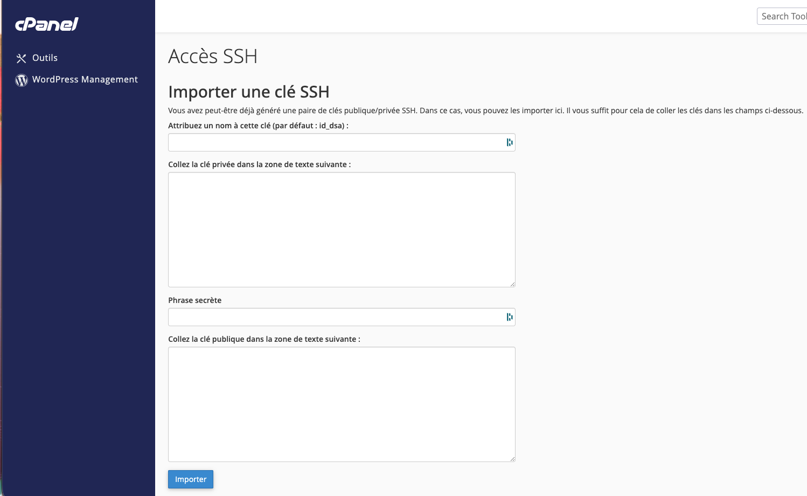

# Boilerplate WordPress Tealforge

Boilerplate WordPress reutilisable pour les projets Tealforge.

Stack par defaut :

- DDEV ;
- WordPress ;
- theme custom `tealforge` ;
- Timber 2 et Twig ;
- ACF JSON ;
- WPForms ;
- Vite ;
- CSS natif moderne ;
- JavaScript natif.

Le depot contient le socle du projet, le theme et les scripts de workflow.
La base de donnees, les medias, les plugins tiers et les secrets ne sont pas
versionnes.

Pour une presentation technique detaillee du socle et de son fonctionnement,
consulter [docs/presentation-boilerplate.md](docs/presentation-boilerplate.md).

## 1. Prerequis

Avant de demarrer un projet, il faut :

- Git ;
- Docker Desktop ;
- DDEV ;
- un depot Git vide pour le projet ;
- un acces WordPress admin local ou distant selon le projet ;
- un acces SSH serveur si un deploiement distant est prevu.

Sous Windows, executer les scripts `bin/*` avec Git Bash ou WSL. Ils ne sont pas
prevus pour PowerShell ou cmd natif.

PHP, Composer, Node.js et WP-CLI doivent etre utilises via DDEV.

## 2. Installation des prerequis

### Docker Desktop

Installer Docker Desktop :

```text
https://docs.docker.com/desktop/setup/install/mac-install/
```

Ouvrir Docker Desktop au moins une fois, puis verifier :

```bash
docker --version
docker ps
```

Si `docker ps` retourne une erreur, Docker n'est probablement pas demarre.

### DDEV

Sur macOS :

```bash
brew install ddev/ddev/ddev
mkcert -install
```

Verifier :

```bash
ddev version
```

Documentation DDEV :

```text
https://ddev.github.io/ddev/en/stable/users/install/ddev-installation/
```

## 3. Installation du projet

Créer d'abord un depot Git vide pour le projet, sans README ni commit initial.

Depuis `~/Sites` :

```bash
cd ~/Sites
git clone git@github.com:ORGANISATION/boilerplate-wordpress-tealforge.git NOM_PROJET
cd NOM_PROJET
```

Remplacer le remote du boilerplate par celui du projet :

```bash
git remote remove origin
git remote add origin git@github.com:ORGANISATION/NOM_PROJET.git
```

Créer le fichier projet :

```bash
cp PROJECT.md.example PROJECT.md
```

Adapter ensuite :

```text
PROJECT.md
.ddev/config.yaml
```

Dans `.ddev/config.yaml`, remplacer :

```yaml
name: NOM_PROJET
```

Démarrer DDEV :

```bash
ddev start
```

Installer WordPress dans `web/` sans écraser `wp-content` :

```bash
ddev wp core download \
  --path=/var/www/html/web \
  --locale=fr_FR \
  --skip-content
```

Créer `wp-config.php` :

```bash
ddev wp config create \
  --path=/var/www/html/web \
  --dbname=db \
  --dbuser=db \
  --dbpass=db \
  --dbhost=db
```

Installer WordPress :

```bash
ddev wp core install \
  --path=/var/www/html/web \
  --url=https://NOM_PROJET.ddev.site \
  --title="NOM_PROJET" \
  --admin_user=tf-admin \
  --admin_password='CHANGE_ME_LOCAL_ONLY' \
  --admin_email=dev@tealforge.local \
  --skip-email
```

Configurer les permaliens :

```bash
ddev wp rewrite structure '/%postname%/' --path=/var/www/html/web
ddev wp rewrite flush --path=/var/www/html/web
```

Installer les dependances du theme :

```bash
ddev composer --working-dir=/var/www/html/web/wp-content/themes/tealforge install
ddev npm --prefix /var/www/html/web/wp-content/themes/tealforge install
```

Builder puis activer le theme :

```bash
bin/build
ddev wp theme activate tealforge --path=/var/www/html/web
```

Installer ensuite les plugins obligatoires depuis l'admin WordPress :

- ACF Pro ;
- WPForms ;
- WPvivid ;
- WP-Optimize ;
- plugin de maintenance ;
- All-In-One Security / AIOS.

Si un environnement dev/prod existe deja, installer WPvivid sur les deux
environnements puis importer la base distante vers le local.

Sens recommande :

```text
dev/prod -> local
```

## 4. Reprise d'un projet existant

Lorsqu'un projet a deja ete initialise avec ce boilerplate et pousse dans son
propre depot, le nouveau developpeur clone le depot du projet. Il ne clone pas
le boilerplate et ne reinstalle pas WordPress.

Depuis `~/Sites` :

```bash
cd ~/Sites
git clone git@github.com:ORGANISATION/NOM_PROJET.git
cd NOM_PROJET
ddev start
```

Le code du projet, le theme, les fichiers ACF JSON et les assets versionnes sont
recuperes par Git. Les dependances locales ne sont pas versionnees et doivent
etre installees dans le theme :

```bash
ddev composer --working-dir=/var/www/html/web/wp-content/themes/tealforge install
ddev npm --prefix /var/www/html/web/wp-content/themes/tealforge install
bin/build
```

La base de donnees WordPress, les medias, les plugins tiers et les reglages ne
sont pas recuperes par Git. Il faut donc demander une sauvegarde ou un acces a
l'environnement de reference, puis importer la base et les medias avec WPvivid.

Apres l'import, verifier au minimum :

- l'URL locale et les permaliens ;
- les utilisateurs et les roles ;
- les pages, menus et contenus ;
- les groupes et les valeurs ACF ;
- les formulaires WPForms ;
- le theme actif et le chargement des assets.

Chaque developpeur doit egalement disposer de ses propres acces Git et SSH. Une
cle SSH personnelle doit etre ajoutee au fournisseur Git et, si necessaire, au
cPanel du serveur. Ne jamais partager une cle privee existante.

## 5. Reprise locale et renommage

Si un projet issu du boilerplate est renomme en local, mettre a jour le nom du
site WordPress, les URLs et le nom DDEV.

Remplacer `NOM_PROJET` par le nouveau nom du projet :

```bash
ddev wp option update blogname "NOM_PROJET"
ddev wp option update siteurl "https://NOM_PROJET.ddev.site"
ddev wp option update home "https://NOM_PROJET.ddev.site"

ddev stop
ddev config --project-name=NOM_PROJET
ddev start
```

Si le mot de passe admin local doit etre reinitialise :

```bash
ddev wp user update tf-admin --user_pass='admin'
```

Cette commande est reservee au local. Ne jamais utiliser de mot de passe faible
sur un environnement distant ou en production.

## 5. Synchronisation ACF apres deploiement

Les definitions ACF versionnees dans `acf-json` ne mettent pas automatiquement la
base de donnees distante a jour. Apres un deploiement qui ajoute ou modifie des
champs ACF, verifier puis synchroniser les JSON avant d'editer les pages.

Commandes WP-CLI recommandees sur le serveur :

```bash
wp acf json status
wp acf json sync --dry-run
wp acf json sync
wp rewrite flush --hard
wp cache flush
```

Si seuls certains types sont concernes, limiter la synchronisation :

```bash
wp acf json sync --type=field-group
wp acf json sync --type=post-type
wp acf json sync --type=taxonomy
```

Si des CPT ou taxonomies ont ete ajoutes ou modifies, relancer les regles de
reecriture avec `wp rewrite flush --hard`. Ne pas sauvegarder une page tant que
les champs ACF attendus ne sont pas visibles dans l'admin.

## 6. Structure du projet

Structure principale :

```text
.
├── AGENTS.md
├── PROJECT.md
├── README.md
├── bin/
├── docs/
├── .ddev/
└── web/
    └── wp-content/
        └── themes/
            └── tealforge/
```

Theme :

```text
web/wp-content/themes/tealforge/
├── inc/
├── views/
├── assets/
├── acf-json/
├── dist/
├── functions.php
└── style.css
```

## 7. Commandes build et Git

Voir l'etat du projet :

```bash
bin/status
```

Builder le theme :

```bash
bin/build
```

Verifier avant commit :

```bash
bin/check
```

Workflow Git classique :

```bash
git status
git add .
git status
git commit -m "Message clair"
git push
```

Workflow Git simplifie :

```bash
bin/commit "Message clair"
bin/push
```

Le script `bin/commit` lance `bin/check`, ajoute les fichiers, puis cree le
commit.

Le dossier `dist` du theme doit rester versionne pour permettre un deploiement
sans Node.js sur le serveur.

### Verification CI locale

La verification utilisee par GitHub Actions et GitLab CI peut aussi etre lancee
localement. Si PHP ou npm ne sont pas installes sur le poste, le script utilise
les outils fournis par DDEV lorsque le projet est demarre.

```bash
bin/ci-check
```

Elle controle le diff Git, la syntaxe PHP du theme, installe proprement les
dependances npm, lance le build Vite et verifie `dist/manifest.json`.

La CI ne deploye rien et ne remplace pas la recette WordPress avec la base, les
plugins et les donnees du projet.

## 8. Acces SSH cPanel

Pour un deploiement SSH via cPanel, creer de preference la cle SSH sur le poste
local, puis importer uniquement la cle publique dans cPanel.

Creer une cle dediee au projet :

```bash
ssh-keygen -t ed25519 -f ~/.ssh/id_ed25519_NOM_PROJET
```

Afficher la cle publique a coller dans cPanel :

```bash
cat ~/.ssh/id_ed25519_NOM_PROJET.pub
```

Dans cPanel :

```text
Acces SSH > Gerer les cles SSH > Importer une cle
```



Remplir les champs ainsi :

```text
Attribuez un nom a cette cle :
id_ed25519_NOM_PROJET

Collez la cle privee :
laisser vide

Phrase secrete :
laisser vide

Collez la cle publique :
coller le contenu de ~/.ssh/id_ed25519_NOM_PROJET.pub
```

Apres l'import, revenir dans la liste des cles SSH et cliquer sur :

```text
Gerer > Autoriser
```

Tester ensuite la connexion :

```bash
ssh -i ~/.ssh/id_ed25519_NOM_PROJET -p PORT USER@HOST
```

Chaque developpeur doit avoir sa propre cle SSH. Ne jamais partager une cle
privee.

### Mot de passe demande en SSH

Il y a deux cas possibles :

- si le terminal demande `Enter passphrase for key`, saisir la phrase secrete de
  la cle SSH creee sur le poste local ;
- si le terminal demande `USER@HOST's password`, saisir le mot de passe du compte
  cPanel/FTP/SSH fourni par l'hebergeur.

Si la connexion demande toujours le mot de passe cPanel alors qu'une cle SSH est
prevue, verifier que la cle publique est bien importee puis autorisee dans cPanel.

## 9. Push en dev/prod

Le serveur distant ne doit pas etre la source du code.

Avant un deploiement :

1. faire un backup ;
2. verifier que le code est commit/push ;
3. lancer `bin/build` ;
4. verifier que `dist/manifest.json` existe ;
5. preparer l'archive du theme.

Créer l'archive :

```bash
bin/package-theme
```

Configurer les variables de deploiement :

```bash
cp deploy.example.env deploy.local.env
```

Modifier `deploy.local.env` :

```text
DEPLOY_HOST="HOST"
DEPLOY_PORT="PORT"
DEPLOY_USER="USER"
DEPLOY_WP_PATH="/chemin/vers/wordpress"
```

Afficher les commandes de deploiement :

```bash
bin/deploy-theme
```

Le script `bin/deploy-theme` revient automatiquement a la racine du projet, puis
lit `deploy.local.env` s'il existe. Il peut donc etre lance depuis la racine ou
via son chemin absolu. Il ne se connecte pas au serveur. Il affiche les commandes
`scp`, `ssh` et les commandes serveur a executer.

Suivre les instructions affichees dans le terminal, dans l'ordre :

1. envoyer l'archive avec la commande `scp` affichee ;
2. se connecter au serveur avec la commande `ssh` affichee ;
3. executer les commandes serveur affichees pour installer ou remplacer le theme ;
4. verifier le `manifest.json` et vider les caches.

Ne jamais envoyer automatiquement :

```text
web/wp-config.php
web/wp-content/uploads/
web/wp-content/cache/
web/wp-content/wpvivid_staging/
sauvegardes
exports SQL
secrets
```

Apres deploiement :

- verifier que le theme actif garde le slug `tealforge` ;
- verifier que `/wp-content/themes/tealforge/dist/manifest.json` repond ;
- verifier que les CSS/JS charges pointent vers `dist/` ;
- vider les caches ;
- synchroniser/importer les ACF JSON si necessaire.

## 10. Documentation utile

```text
docs/checklists/nouveau-projet.md
docs/architecture-theme.md
docs/creer-section.md
docs/depannage.md
docs/presentation-boilerplate.md
docs/evolution-boilerplate.md
```

`AGENTS.md` contient les consignes generales pour Codex, Claude Code et les autres
agents IA.

`CLAUDE.md` est le point d'entree de Claude Code et renvoie vers `AGENTS.md`.

`PROJECT.md` contient les informations propres au projet courant.
